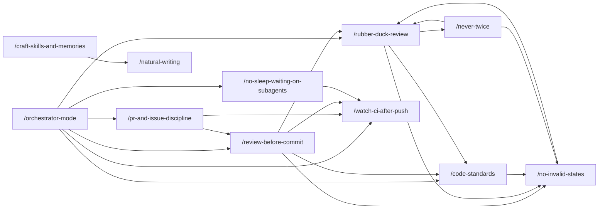

# Skills

[](https://github.com/Vivswan/skills/actions/workflows/ci.yml)

A collection of skills for AI coding agents. Skills are packaged instructions and resources that extend agent capabilities.

## About This Repository

This repo keeps the collection-style catalog and install flow from `vercel-labs/agent-skills`, while also keeping each skill folder plugin-ready so MCP servers, hooks, or app integrations can be added later without changing the layout. The root [`.claude-plugin/marketplace.json`](./.claude-plugin/marketplace.json) publishes the whole catalog as a single `vivswan-skills` plugin for Claude Code marketplace installs, with [`.claude-plugin/plugin.json`](./.claude-plugin/plugin.json) as the plugin manifest, but the main experience stays centered on `npx skills add ...`.

## Available Skills

### Automatic

The agent applies these on its own when the task matches:

- [/code-standards](./skills/code-standards/) - House standards for maintainable code, folded into reviews
- [/craft-skills-and-memories](./skills/craft-skills-and-memories/) - Create and repair skills and memories at their canonical source
- [/never-twice](./skills/never-twice/) - Climb every repeated failure to the most durable fix reachable
- [/no-invalid-states](./skills/no-invalid-states/) - Invariants in the type system instead of runtime checks
- [/no-sleep-waiting-on-subagents](./skills/no-sleep-waiting-on-subagents/) - React to completion notifications, never sleep or poll
- [/pr-and-issue-discipline](./skills/pr-and-issue-discipline/) - Visualization-first PRs and issues, draft discipline, human-gated merges
- [/review-before-commit](./skills/review-before-commit/) - Independent review converges before any commit
- [/rubber-duck-review](./skills/rubber-duck-review/) - Cross-model, read-only second-opinion code review
- [/watch-ci-after-push](./skills/watch-ci-after-push/) - Background CI watcher after every push

### Invoked by you

Load only when you invoke them (`/skill-name` in Claude Code, `$skill-name` in Codex):

- [/natural-writing](./skills/natural-writing/) - Prose without AI writing tells
- [/orchestrator-mode](./skills/orchestrator-mode/) - Parallel worktree subagents with gated landings, direct or PR-based

How the skills reference each other (an arrow means "mentions and hands off to, where installed"):



## Installation

```bash
npx skills add Vivswan/skills -g
```

Install a specific skill:

```bash
npx skills add Vivswan/skills -g --skill rubber-duck-review
```

Install to a specific agent:

```bash
npx skills add Vivswan/skills -g --skill rubber-duck-review -a codex
npx skills add Vivswan/skills -g --skill rubber-duck-review -a claude-code
npx skills add Vivswan/skills -g --skill rubber-duck-review -a github-copilot
```

Install directly from the skill folder:

```bash
npx skills add https://github.com/Vivswan/skills/tree/main/skills/rubber-duck-review -g
```

Or install everything as a Claude Code plugin:

```text
/plugin marketplace add Vivswan/skills
/plugin install vivswan-skills@vivswan-skills
```

## Usage

Skills are automatically available once installed. The agent will use them when relevant tasks are detected. Skills marked explicit-invocation-only ([`/natural-writing`](./skills/natural-writing/), [`/orchestrator-mode`](./skills/orchestrator-mode/)) load only when you invoke them (e.g. [`/natural-writing`](./skills/natural-writing/) in Claude Code).

**Examples:**

```bash
Rubber duck this patch before we merge it
```

```bash
Get a second opinion on this refactor
```

## Compatibility

The repo is designed around a shared skill core plus optional agent-specific plugin metadata.

| Capability | Claude Code | Codex | GitHub Copilot |
| --- | --- | --- | --- |
| Install with `npx skills add Vivswan/skills` | Yes | Yes | Yes |
| Plain `SKILL.md` workflow | Yes | Yes | Yes |
| Root `.claude-plugin/marketplace.json` | Yes, optional enhancement | Not primary path | Not primary path |
| Per-skill `.codex-plugin/plugin.json` | Not primary path | Yes, optional enhancement | Not primary path |
| MCP via per-skill config | Yes, if the plugin host supports it | Yes, if the plugin host supports it | Keep a skill-only fallback |

Compatibility rules for every skill in this repo:

- `npx skills add ...` is the primary install path across agents.
- `SKILL.md` must contain a complete fallback workflow even if plugin or MCP integrations are added.
- Plugin manifests are additive enhancements, not a requirement for using the skill.
- GitHub Copilot compatibility should assume skill-first installation rather than plugin-specific behavior.

## Validation

Run the repo checks before publishing changes:

```bash
bun run check
```

That runs the TypeScript typecheck, the Biome lint, YAML and JSON schema lints, the unit tests, structural validation ([`scripts/validate-skills.ts`](./scripts/validate-skills.ts)), and cross-file consistency checks ([`scripts/smoke-test.ts`](./scripts/smoke-test.ts)). CI runs the same script through [`.github/workflows/checks.yml`](./.github/workflows/checks.yml), plus an end-to-end test that the real `npx skills` CLI discovers and groups every skill ([`scripts/cli-discovery-test.ts`](./scripts/cli-discovery-test.ts)).

## License

Individual and Small Organization License 1.0.0 - see [LICENSE.md](./LICENSE.md).
