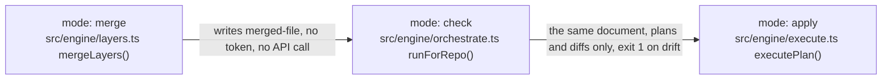

# Architecture Page

One layering declaration, two readers, one page whose every box names real code. The declaration cannot rot because a lint fails in both directions; the page cannot rot because a test checks every path, symbol, and demonstration link it names.

## The specimen

`architecture.yml` at the repository root (excerpt from Vivswan/github-settings-as-code):

```yaml
layers:
  main: [src/main.ts]
  engine: [src/engine/]
  sections: [src/sections/]
  schema: [src/schema.ts]
  types: [src/types.ts]

exclude:
  - src/sections/*/mock.ts
  - "src/**/*.test.ts"

# from -> the layers it may import; a layer absent here imports nothing outside itself.
edges:
  main: [engine]
  engine: [schema, sections, types]
  sections: [engine, schema, types]
  schema: [sections, types]
```

One concept diagram from the page, with its bullets and demonstration line (`docs/reference/architecture.md`):

````markdown
## The mode ladder



Each rung is safe to run before the next, and moving a file up the ladder changes nothing about the file.

- Merge touches only local files.
- Check plans and diffs every active section; nothing executes.
- Apply executes the plan. Under the default `on-missing-permission: fail`, a read-only preflight over the active sections runs first and refuses to write anything when one is denied.

Demonstrated by: [test/engine/check-purity.test.ts](https://github.com/Vivswan/github-settings-as-code/blob/main/test/engine/check-purity.test.ts), [test/engine/layers.test.ts](https://github.com/Vivswan/github-settings-as-code/blob/main/test/engine/layers.test.ts).
````

The page header says what the checks prove: existence only. A caption-only box (`mode`, `merged-file`) names no file and is not checked; a demonstration link is checked to resolve, not to test the claim above it.

## The recipe

The three scripts ship with this skill. Copy them into the repository (for example `.github/scripts/`) so its check command runs without the skill installed; they import only each other, bun, and the `oxc-parser` package.

```bash
cp "<skill-dir>/scripts/"{arch-lint,render-architecture-map,check-architecture-page}.mts .github/scripts/
bun add -d oxc-parser
```

Without the parser every script exits 2 with `architecture-page scripts need oxc-parser: bun add -d oxc-parser`.

### 1. Declare the layers, then make the lint pass

- Write `architecture.yml`: `layers` (name to paths; a trailing slash is a directory), `exclude` (test fragments, fixtures), `edges` (from-layer to the layers it may import).
- Type-only imports count as edges, and so does any `require(...)` call, including one bound locally as `createRequire(import.meta.url)`, which does load modules. Imports inside one layer are not edges.
- `exclude` removes a file as a source only; an import into an excluded file is still an edge. Only relative specifiers are read; a path alias is invisible to the lint, so declare the tree, not the alias.
- Run the lint and fix until it prints the match line:

```bash
bun .github/scripts/arch-lint.mts --root .            # exit 0: arch-lint: imports under src match architecture.yml
```

| Message | What to do |
| --- | --- |
| `forbidden import a -> b: src/a/x.ts -> src/b/y.ts; move it or declare the edge` | Move the import, or add `b` under `edges.a` when the dependency is right |
| `stale allowance a -> b: no file draws it; remove it from architecture.yml` | Delete `b` from `edges.a`; the declaration lists only edges the code draws |
| `src/z.ts belongs to no layer in architecture.yml` | Add the file to a layer or to `exclude`; nothing is silently dropped |
| `src/a/x.ts:12 loads a module through a computed specifier ...` (exit 2) | Rewrite `import(name)` with a string literal; the graph cannot follow a variable |

### 2. Give the page a generated region and render the map

Put this under the page's last heading; the markers stay, the body is the script's:

```markdown
## The module map

Each node is one layer, labelled with the paths it owns; an arrow means the layer imports the other. Rendered from `architecture.yml`; the lint keeps that declaration equal to the import graph.

<!-- BEGIN GENERATED: architecture-map (bun render-architecture-map.mts; derived from architecture.yml) -->
<!-- END GENERATED: architecture-map -->
```

```bash
bun .github/scripts/render-architecture-map.mts --page docs/reference/architecture.md          # writes the fence
bun .github/scripts/render-architecture-map.mts --page docs/reference/architecture.md --check  # exit 1 on drift, for CI
```

### 3. Author the concept diagrams, box by box, against real symbols

One hand-authored mermaid flowchart per concept, above the module map. Rules per box and per diagram:

- A box that names a file lists the exported symbols it means: `src/engine/layers.ts<br>stripNulls() mergeLayers()`. Open the file and copy the names; never write one from memory. The exported name counts, so `export { oldName as newName }` exports `newName`, a default export is `default()`, and `export * from` carries the target's names.
- An edge label that carries brackets or parentheses (`run()`) is quoted or in the `|...|` form: `-- "run()" -->` or `-->|run()|`.
- A caption-only box is allowed (`mode`, `the live repository`); a box that mixes prose after a path is read as symbols and fails.
- Quote every label. The check cannot read an unquoted one and says so.
- Under each diagram, 3 to 6 bullets stating only what the diagram cannot show: the reason, the invariant, the consequence.
- A bullet that restates an arrow is deleted. It fails the test `/code-standards` applies to comments: what does this say that the picture does not?
- Close with `Demonstrated by:` and links to the test or e2e scenario that covers the concept, as repository URLs or paths relative to the page.

### 4. Add the page test

Run the check with the diagram count pinned; the count changes only when a diagram is added or removed on purpose:

```bash
bun .github/scripts/check-architecture-page.mts --page docs/reference/architecture.md \
  --repo-url https://github.com/<owner>/<repo>/blob/main/ --expect-diagrams 7
# exit 0: check-architecture-page: docs/reference/architecture.md names real code (concept diagrams: 7)
```

| Message | What to do |
| --- | --- |
| `"<label>": src/engine/nowhere.ts does not exist` | The file moved or the path is mistyped; fix the box |
| `"<label>": src/engine/layers.ts exports no foldAll` | The symbol was renamed or never exported; fix the box, not the file |
| `"<label>": "srcc/engine/x.ts" looks like code but reads as a caption` | The first path segment is not a top-level directory; fix the typo |
| `line 41: the diagram has no "Demonstrated by:" line before the next heading` | Add the line with a link to the covering test |
| `expected 7 concept diagrams, found 6` | A diagram vanished, or you added one: update `--expect-diagrams` in the same change |

Repositories that already have a bun test suite can import the same functions instead: `diagramProblems`, `conceptCounts`, `lintArchitecture`, `renderArchitectureMermaid` are exported by the scripts.

### 5. Wire the gates

Both readers and the page check run inside the repository's check command, and the page is a required page of the docs site:

```json
{
  "scripts": {
    "lint:arch": "bun .github/scripts/arch-lint.mts --root .",
    "build:docs": "bun .github/scripts/render-architecture-map.mts --page docs/reference/architecture.md",
    "build:check": "bun .github/scripts/render-architecture-map.mts --page docs/reference/architecture.md --check",
    "test:docs": "bun .github/scripts/check-architecture-page.mts --page docs/reference/architecture.md --repo-url https://github.com/<owner>/<repo>/blob/main/ --expect-diagrams 7",
    "check": "bun run lint && bun run lint:arch && bun run typecheck && bun run test && bun run test:docs && bun run build:check"
  }
}
```

## Maintaining the page after a change

- Code moved across layers: run the lint; it names the edge to declare or the import to move. Then re-render the map and commit both.
- A symbol renamed: the page check names the box; fix the box in the same change as the rename.
- A concept added: a new H2, its diagram, its bullets, its demonstration line, and `--expect-diagrams` plus one.
- Never edit between the GENERATED markers; the drift check rejects it and the next render overwrites it.

## Review Criteria

- A box names a symbol its file does not export, or a path that does not exist (run `check-architecture-page.mts`; do not trust the diff).
- The module map shows an edge the code does not draw, or was edited by hand inside the GENERATED region (run `arch-lint.mts` and `render-architecture-map.mts --check`).
- A concept diagram has no `Demonstrated by:` line, or its link does not resolve to a test or scenario.
- Bullets under a diagram restate the arrows instead of stating what the diagram cannot show.
- The change moved code across layers without touching `architecture.yml`, or added an allowance no import draws.
- The page header no longer says the checks prove existence only.
