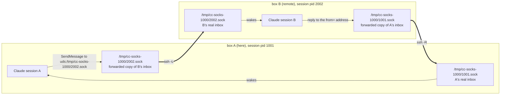
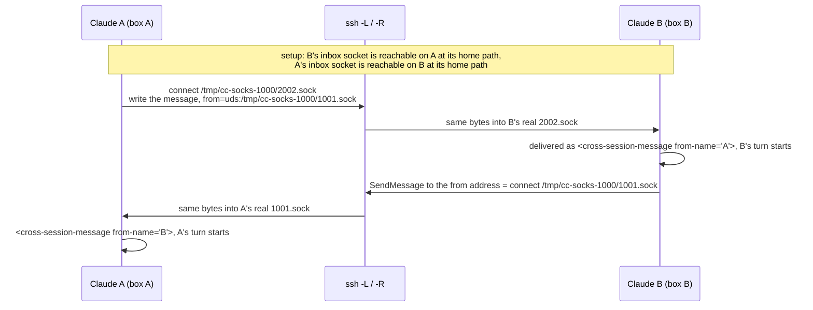

# How Claude Code peer messaging works, and how the bridge rides it

This page owns the protocol facts; `../SKILL.md` owns the workflow.

## Picture



One message, step by step:



## What every session owns on its own machine

| Path | Content |
|------|---------|
| `/tmp/cc-socks-<uid>/<pid>.sock` | inbox: a Unix socket the session listens on |
| `~/.claude/sessions/<pid>.json` | registry record: `pid`, `name`, `messagingSocketPath`, `status`, ... `ListAgents` reads these |
| `~/.claude/sessions/<pid>.<sha256(socketPath)>.key` | `{"peerToken": <32 hex>, ...}`, presented by senders when present |

Wire format, one connection per message:

```text
{"type":"<auth>","token":"<peerToken>"}\n     (omitted when the sender has no key for that path)
{"type":"user","message":{...},"from":"uds:/tmp/cc-socks-1000/1001.sock","msg_id":...}\n
```

## The five facts the bridge rests on

**Addressing by socket path.** `SendMessage` accepts `uds:<socket path>` as `to`, the same form it puts in `from`. No registry record is needed to send.

**Auth is optional outside Windows.** The receiver requires the token only on Windows. A sender with no key file for the target path sends without the token line, and a Linux or macOS receiver delivers it.

**Reply routing** uses the `from` address in the message, which is the sender's own socket path. That is why the reverse forward (`-R`) is required.

**The path must be the same on both sides.** The message's `from` is an absolute path on the sender's machine, and the reply lands only if that path is a socket on the receiver's machine too. So each socket is forwarded to the exact path it has at home.

**OpenSSH forwards Unix sockets.** `-L a:b` creates socket `a` locally and carries each connection to socket `b` on the remote; `-R` is the mirror image. Supported since OpenSSH 6.7 on both ends.

## Why the bridge copies nothing

Copying B's registry record into A's `~/.claude/sessions/` makes `ListAgents` list B by name, because a record whose `pidDomain` (pid namespace id) is foreign skips the pid check. That rule exists for containers sharing a home folder.

But the copy is a snapshot. `status` and `name` go stale, the entry outlives B, and Claude Code never sweeps a foreign-domain record. Addressing by path avoids all of that, so the bridge does not copy.

## The one-time lookup

The bridge needs B's socket path once. `scripts/bridge.mts` runs a short python program on B over ssh that reads every `~/.claude/sessions/*.json` and prints the records that are live: a record alone does not mean a live session, so one counts only when its pid answers a signal 0 and its inbox path is a socket. The newest live one wins unless a pid is given.

The lookup is python fed on ssh's stdin rather than a shell loop, so B's login shell plays no part: zsh does not word-split unquoted variables, which broke the shell version.

## Security

Not a boundary. Anyone who can ssh as you to both boxes can do this, and on Linux the inbox accepts unauthenticated local senders anyway. The bridge adds no exposure beyond what ssh access already grants.
